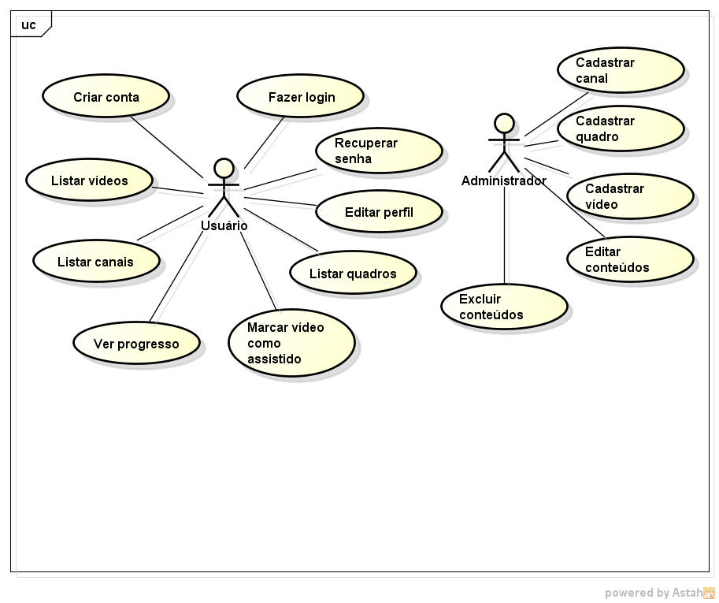

# PARTE II – MODELO DE CASOS DE USO

## 2. Modelo de Casos de Uso

### 2.1 Diagrama de Casos de Uso

> O diagrama representa graficamente os atores do sistema YTTrack e suas interações com os principais casos de uso, utilizando a notação padrão da UML.

### 2.1 Atores

* Usuário (Criador de Conteúdo)
* Administrador

### 2.2 Lista de Casos de Uso Principais

* UC01: Autenticar Usuário
* UC02: Cadastrar Canal do YouTube
* UC03: Gerenciar Vídeos
* UC04: Visualizar Métricas e Relatórios

---

## 2.3 Especificações Textuais dos Casos de Uso

### UC01 – Autenticar Usuário

* **Atores**: Usuário (Criador de Conteúdo)
* **Descrição**: Permite que o usuário acesse o sistema YTTrack por meio de credenciais válidas.
* **Pré-condições**: Usuário deve estar previamente cadastrado no sistema.
* **Pós-condições**: Usuário autenticado e com sessão ativa no sistema.
* **Fluxo Principal**:

  1. Usuário acessa a tela de login.
  2. Usuário informa e-mail e senha.
  3. Sistema valida as credenciais.
  4. Sistema autentica o usuário e libera o acesso às funcionalidades.
* **Fluxos Alternativos**:

  * 3a. Credenciais inválidas → sistema exibe mensagem de erro e solicita nova tentativa.
* **Exceções**:

  * Falha de conexão com o servidor de autenticação.
* **Modelo de Interação Associado**: Diagrama de Sequência – Autenticação de Usuário.

---

### UC02 – Cadastrar Canal do YouTube

* **Atores**: Usuário (Criador de Conteúdo)
* **Descrição**: Permite ao usuário registrar um canal do YouTube para gerenciamento dentro do sistema.
* **Pré-condições**: Usuário autenticado no sistema.
* **Pós-condições**: Canal do YouTube cadastrado e associado ao usuário.
* **Fluxo Principal**:

  1. Usuário acessa a opção "Cadastrar Canal".
  2. Usuário informa dados do canal (nome, URL, descrição).
  3. Sistema valida os dados informados.
  4. Sistema salva o canal no banco de dados.
* **Fluxos Alternativos**:

  * 3a. Dados incompletos ou inválidos → sistema solicita correção.
* **Exceções**:

  * Canal já cadastrado no sistema.
* **Modelo de Interação Associado**: Diagrama de Sequência – Cadastro de Canal.

---

### UC03 – Gerenciar Vídeos

* **Atores**: Usuário (Criador de Conteúdo)
* **Descrição**: Permite cadastrar, editar e organizar informações dos vídeos do canal.
* **Pré-condições**: Canal do YouTube previamente cadastrado.
* **Pós-condições**: Vídeos cadastrados ou atualizados no sistema.
* **Fluxo Principal**:

  1. Usuário seleciona um canal.
  2. Usuário acessa a opção "Gerenciar Vídeos".
  3. Usuário cadastra ou edita informações do vídeo (título, descrição, data de publicação).
  4. Sistema valida os dados.
  5. Sistema salva as alterações.
* **Fluxos Alternativos**:

  * 4a. Dados inválidos → sistema solicita ajustes.
* **Exceções**:

  * Vídeo não encontrado para edição.
* **Modelo de Interação Associado**: Diagrama de Comunicação – Gerenciamento de Vídeos.

---

### UC04 – Visualizar Métricas e Relatórios

* **Atores**: Usuário (Criador de Conteúdo)
* **Descrição**: Permite visualizar métricas de desempenho dos vídeos e do canal.
* **Pré-condições**: Existência de vídeos cadastrados no sistema.
* **Pós-condições**: Métricas exibidas ao usuário.
* **Fluxo Principal**:

  1. Usuário seleciona a opção "Relatórios".
  2. Usuário escolhe o período desejado.
  3. Sistema processa os dados de desempenho.
  4. Sistema exibe gráficos e indicadores.
* **Fluxos Alternativos**:

  * 3a. Período sem dados → sistema exibe mensagem informativa.
* **Exceções**:

  * Falha no processamento dos dados.
* **Modelo de Interação Associado**: Diagrama de Sequência – Geração de Relatórios.
